---

name: mermaid-diagram
description: 使用 Mermaid 语法生成流程图、时序图、类图、状态图、ER 图、甘特图、饼图、思维导图、时间线、Git 图、桑基图、XY 图、块图、象限图和用户旅程图；适用于用户要求画图、导图、流程图、架构图、时序图、甘特图、数据关系图或需要输出 PNG、SVG、PDF、HTML 时。
---
# Mermaid Diagram 画图技能

> 将文本快速转换为可渲染的 Mermaid 图表，并根据图表类型自动选择合适的布局、画布尺寸和输出格式。

## 适用场景

当用户提到以下需求时，优先启用本技能：脑图、思维导图、流程图、架构图、泳道图、时序图、甘特图、饼图、类图、状态图、ER 图、时间线、Git 图、桑基图、XY 图、象限图、用户旅程图、块图，或明确要求 Mermaid / mmdc / PNG / SVG / PDF / HTML 输出。

## 目标

1. 先判断图表类型，再决定布局方向和画布尺寸。
2. 优先生成可直接渲染的 Mermaid 代码。
3. 需要导出时，优先给出 PNG，其次 SVG / PDF / HTML。
4. 避免过宽、过高、过密的图，必要时拆图。

## 输出规范

### PNG / SVG / PDF

推荐使用 Mermaid CLI `mmdc`：

```bash
mmdc -i input.mmd -o output.png -w <宽度> -H <高度> -b <背景色> -t <主题>
```

常用参数：

| 参数   | 说明                             | 默认值       |
| ---- | ------------------------------ | --------- |
| `-i` | 输入 `.mmd` 文件                   | 必填        |
| `-o` | 输出文件（`.png` / `.svg` / `.pdf`） | 必填        |
| `-w` | 宽度（像素）                         | 800       |
| `-H` | 高度（像素）                         | 600       |
| `-b` | 背景色                            | `white`   |
| `-t` | 主题                             | `default` |
| `-s` | 缩放比例                           | 1         |
| `-c` | 配置文件                           | 无         |

### HTML

需要交互或后续修改时，可输出 HTML 预览页：

```html
<!DOCTYPE html>
<html>
<head>
  <meta charset="UTF-8" />
  <title>Mermaid Diagram</title>
  <script type="module">
    import mermaid from 'https://cdn.jsdelivr.net/npm/mermaid@11/dist/mermaid.esm.min.mjs';
    mermaid.initialize({ startOnLoad: true, theme: 'default' });
  </script>
</head>
<body>
  <pre class="mermaid">
    flowchart TD
      A[Start] --> B[End]
  </pre>
</body>
</html>
```

## 布局与排版规则

### 1. 宽高比控制

* 避免极端比例，尽量控制在 3:1 到 1:3 之间。
* 节点 ≤ 6 个时，流程图优先用 `LR`。
* 节点 ≥ 7 个时，流程图优先用 `TD`。
* 单层节点数建议不超过 5 到 6 个。
* 节点超过 15 个时，优先拆成多张图。

### 2. 方向选择

| 方向    | 关键字         | 适用场景          |
| ----- | ----------- | ------------- |
| 上 → 下 | `TD` / `TB` | 层级结构、决策树、组织架构 |
| 左 → 右 | `LR`        | 流程、管道、时间线式流程  |
| 下 → 上 | `BT`        | 自底向上的构建过程     |
| 右 → 左 | `RL`        | 回溯、反向流程       |

### 3. 推荐画布尺寸

| 图表类型                      | 推荐宽度 | 推荐高度 |
| ------------------------- | ---- | ---- |
| Flowchart (TD, ≤8 节点)     | 800  | 600  |
| Flowchart (LR, ≤6 节点)     | 1000 | 500  |
| Flowchart (大型 >10 节点)     | 1200 | 800  |
| Sequence Diagram (≤5 参与者) | 800  | 600  |
| Sequence Diagram (>5 参与者) | 1200 | 600  |
| Class Diagram             | 1000 | 700  |
| State Diagram             | 800  | 600  |
| ER Diagram                | 1000 | 700  |
| Gantt Chart (≤10 任务)      | 1000 | 500  |
| Gantt Chart (>10 任务)      | 1200 | 700  |
| Pie Chart                 | 700  | 700  |
| Mindmap                   | 1000 | 700  |
| Timeline (≤5 时期)          | 1000 | 500  |
| Timeline (>5 时期)          | 1200 | 600  |
| Git Graph                 | 1000 | 500  |
| Sankey Diagram            | 1000 | 600  |
| XY Chart                  | 800  | 600  |
| Quadrant Chart            | 700  | 700  |
| User Journey              | 1000 | 500  |
| Block Diagram             | 800  | 600  |

## 图表类型与语法要点

### Flowchart

适合业务流程、决策树、算法步骤、系统架构。

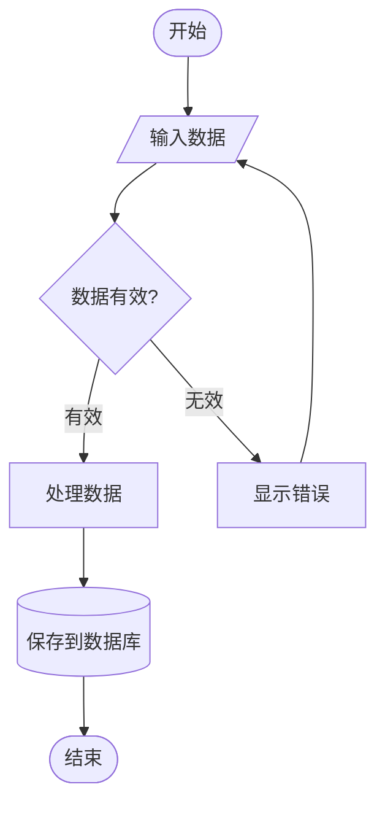

注意：`end` 是保留字，作为节点文本时要加引号，例如 `A["end"]`。节点 ID 建议用英文或数字，节点文字可以使用中文。

### Sequence Diagram

适合 API 调用、微服务交互、协议握手。

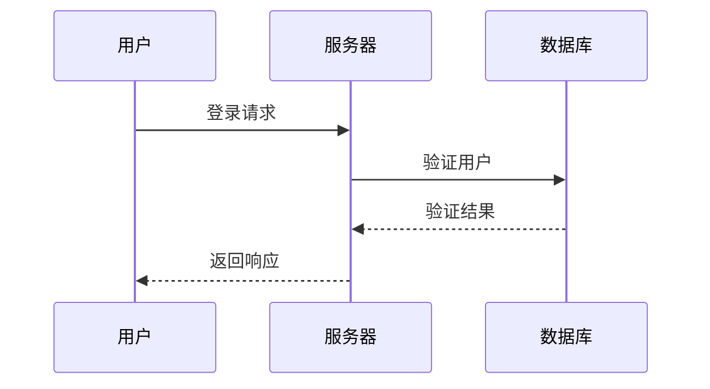

### Class Diagram

适合面向对象设计、系统结构、数据模型。

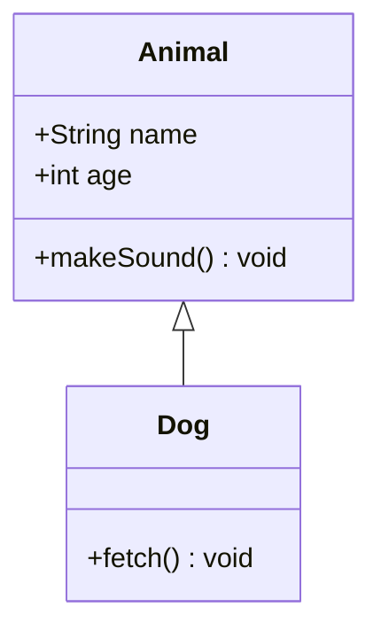

### State Diagram

适合状态机、对象生命周期、协议状态。

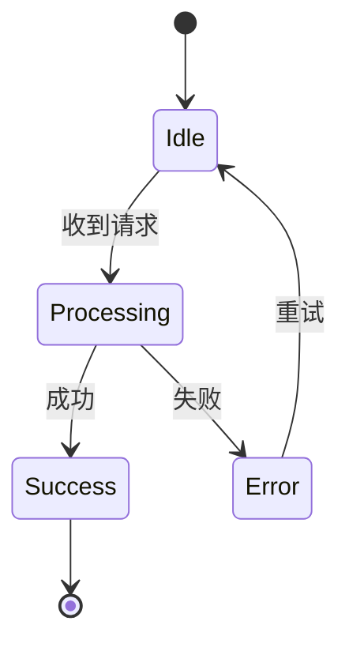

### ER Diagram

适合数据库设计、实体关系表达。

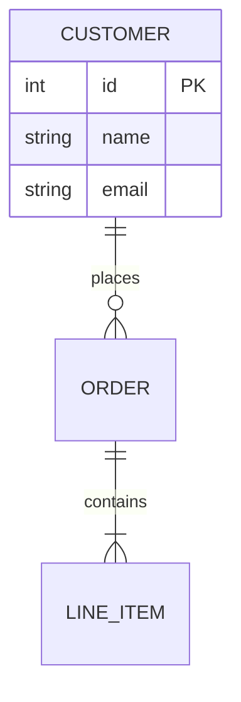

### Gantt Chart

适合项目计划、里程碑、排期。

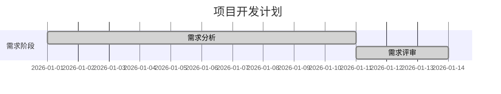

### Pie Chart

适合比例分布、市场份额。

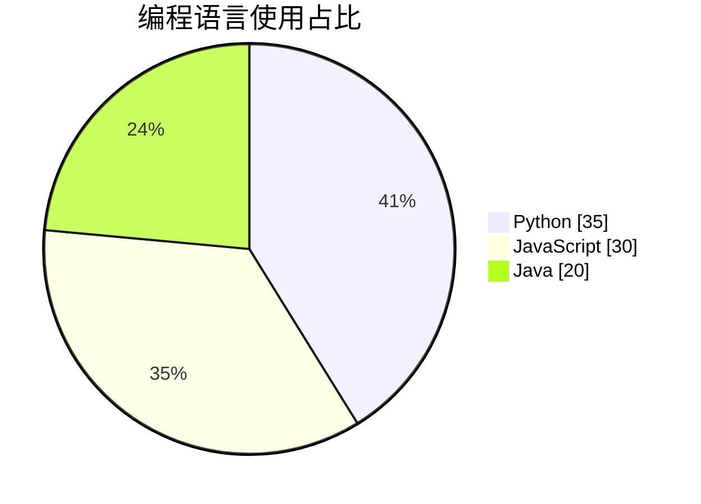

### Mindmap

适合知识梳理、头脑风暴、概念拆解。

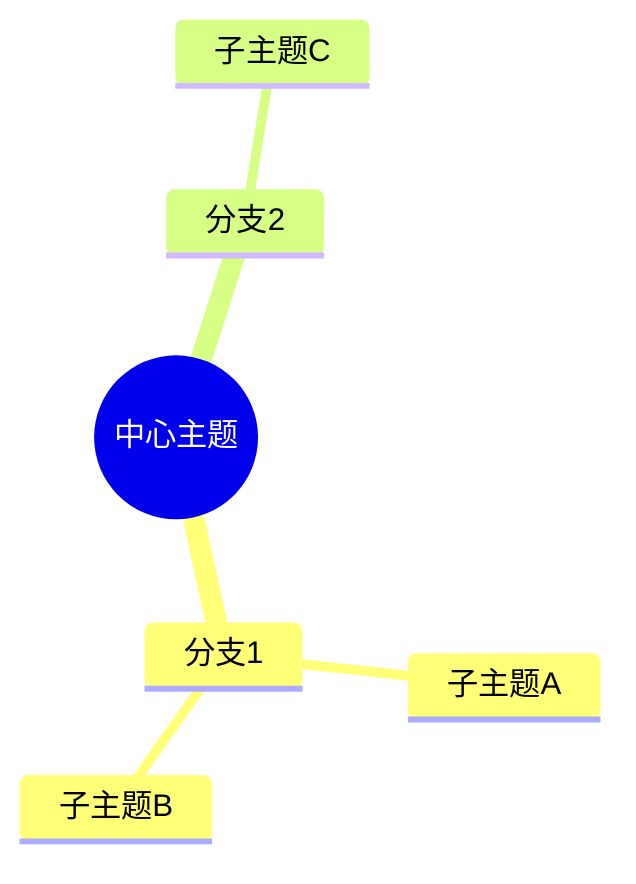

### Timeline

适合历史事件、版本记录、发展脉络。

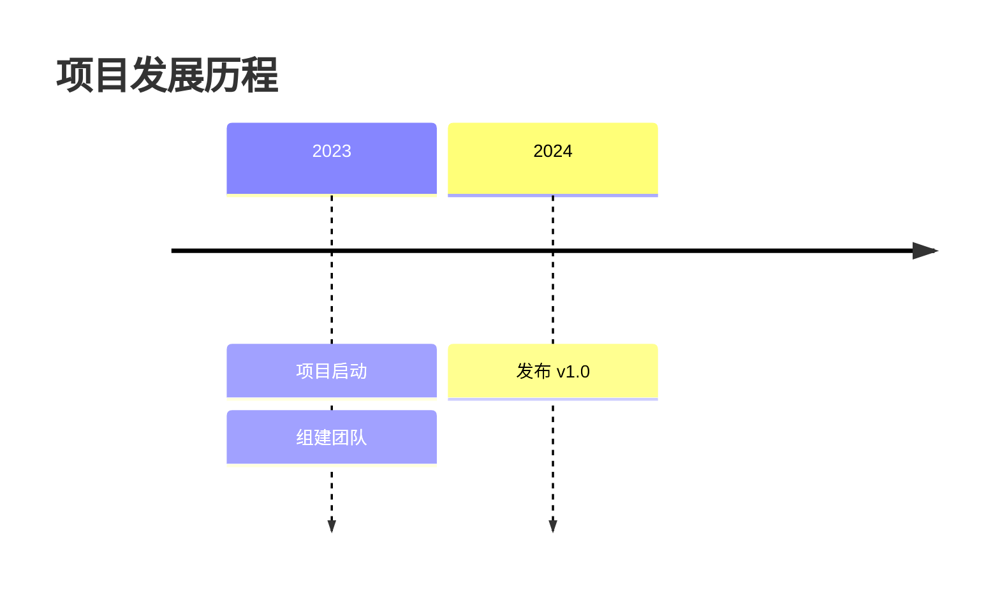

### Git Graph

适合 Git 分支策略、版本流转。

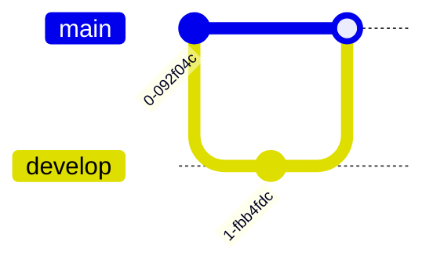

### Sankey Diagram

适合流向、迁移、资金或能量传递。

```mermaid
sankey-beta
来源A,目标X,50
来源A,目标Y,30
来源B,目标X,20
```

### XY Chart

适合趋势图、柱状图、折线图。

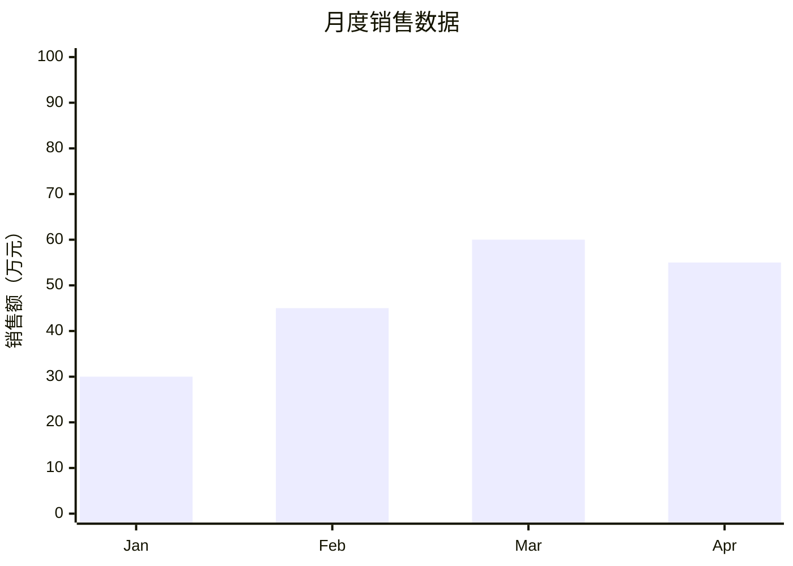

### Block Diagram

适合系统架构、模块分层、组件关系。


### Quadrant Chart

适合优先级矩阵、SWOT、竞品对比。

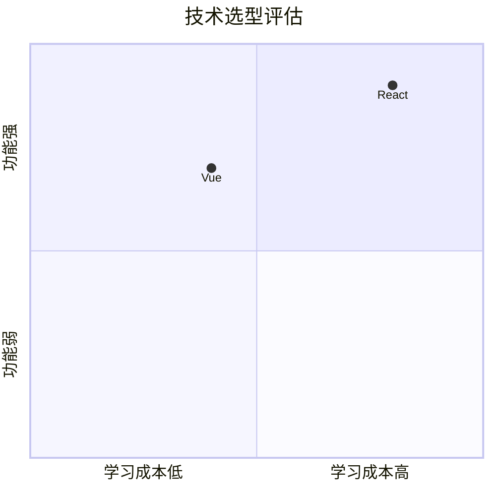

### User Journey

适合用户体验分析、服务蓝图、流程痛点。

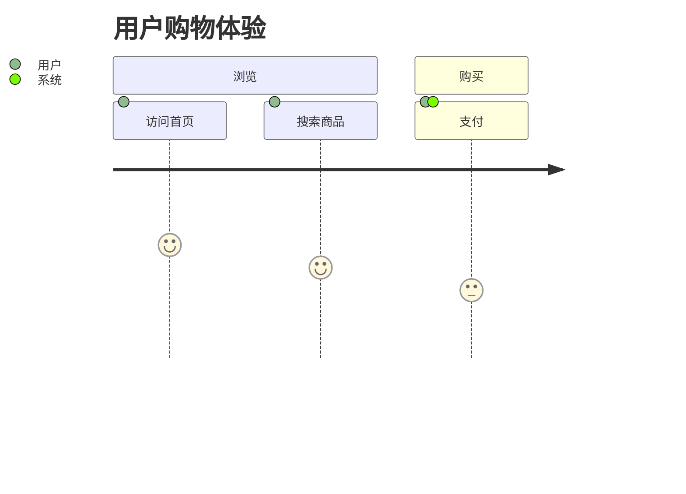

## 主题配置

支持的主题：`default`、`forest`、`dark`、`neutral`。

示例：

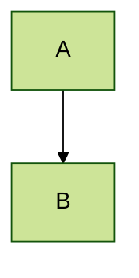

## 复杂图表拆分策略

* 流程图节点 > 15：按阶段拆成 2 到 3 张图。
* 时序图参与者 > 8：按场景拆分。
* 类图类 > 10：按模块或包拆分。
* ER 图实体 > 8：按业务域拆分。
* 思维导图 > 4 层：按主分支拆成多张图。

## 常见注意事项

1. `end`、引号、括号、花括号等特殊字符容易影响解析，必要时包裹为文本。
2. 节点 ID 尽量用英文、数字和下划线，文字标签可以用中文。
3. Mindmap 和 Timeline 对缩进非常敏感，建议统一使用 2 或 4 空格。
4. Sankey、XY Chart、Block Diagram 等 beta 语法可能随版本变化。
5. 图表过密时优先拆图，不要强行塞进一张图。

## 推荐工作流

1. 先识别用户想要的图表类型。
2. 根据内容选择方向、节点数量和画布大小。
3. 先输出 Mermaid 源码，再按需要输出 PNG、SVG、PDF 或 HTML。
4. 若图太复杂，主动拆分为多张图。
