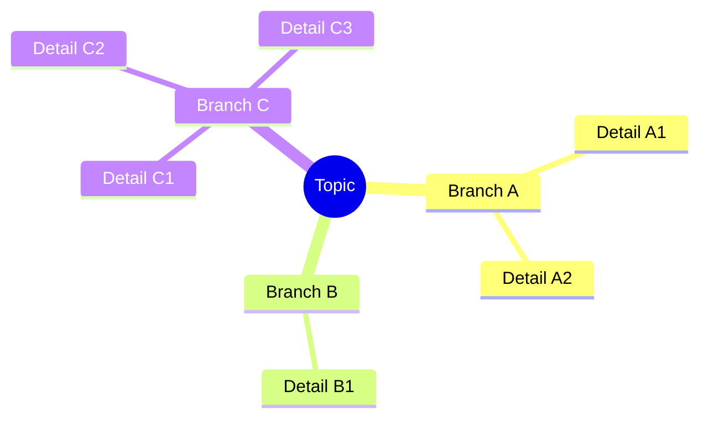
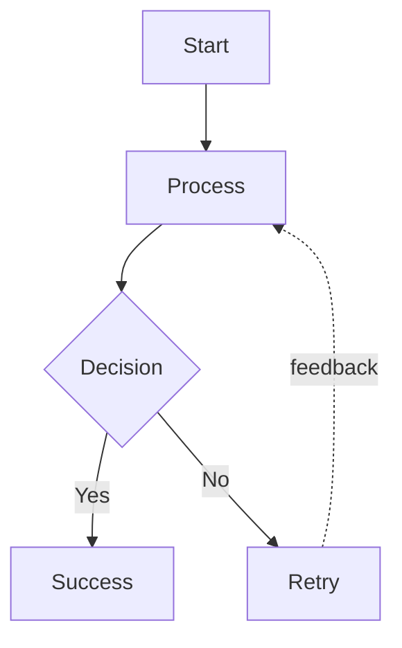
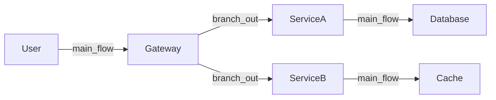
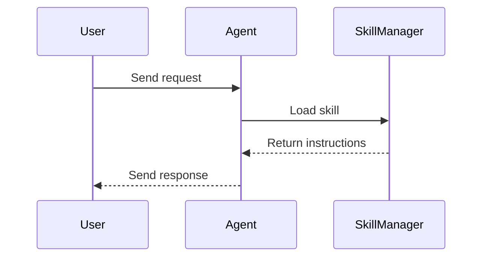
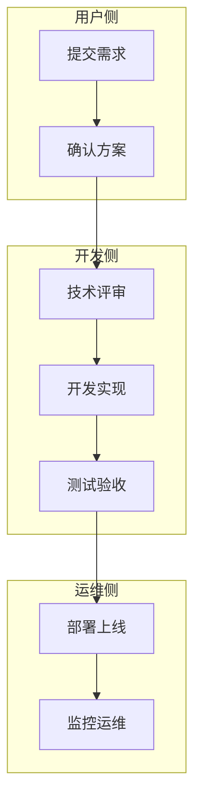
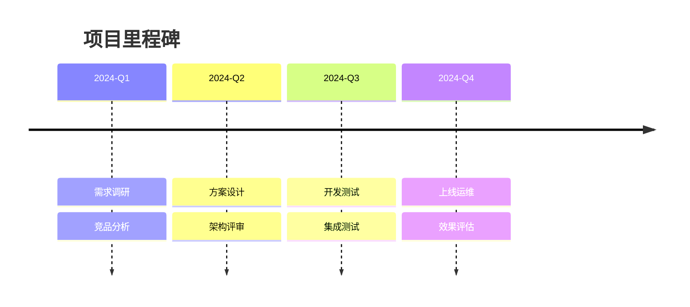
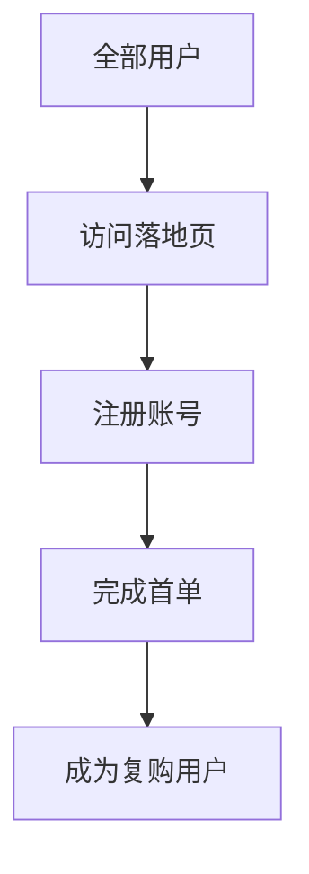
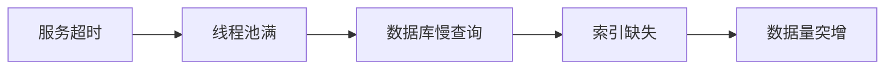

# Diagram Reference Guide

## 支持的图表类型

| 类型 | 最佳用途 | Mermaid 语法 |
|---|---|---|
| mindmap | 知识结构、总结汇报、读书笔记 | `mindmap` |
| flowchart | 流程、决策、逻辑分支 | `flowchart TD/LR` |
| graph LR | 架构、模块关系 | `graph LR` |
| sequenceDiagram | 交互时序、请求响应 | `sequenceDiagram` |
| swimlane | 跨角色/跨部门协作流程 | `flowchart TD` + subgraph |
| timeline | 项目里程碑、时间节点 | `timeline` |
| funnel | 筛选/转化流程 | `flowchart TD` 渐窄 |
| causal chain | 根因分析、因果传导 | `flowchart LR` |

## Mind map 模式

## Flowchart 模式

## Architecture 模式

## Sequence 模式

## Swimlane 模式

## Timeline 模式

## Funnel 模式

## Causal chain 模式

## 连线类型速查

| 类型 | 含义 | Mermaid | 使用场景 |
|---|---|---|---|
| main_flow | 主路径推进 | `A --> B` | 核心流程 |
| branch_out | 一处分多支 | `A --> B; A --> C` | 条件分支 |
| fan_in | 多处汇一 | `B --> D; C --> D` | 结果合并 |
| feedback | 反馈/回退 | `D -.-> A` | 循环/重试 |
| convergence | 收敛 | `B --> D; C --> D` + 标注 | 方案收敛 |

## 节点数量参考

| 图类型 | 建议最大节点数 | 超过时建议 |
|---|---|---|
| mindmap | 一级 4-6, 总计 ≤30 | 拆分为多张子图 |
| flowchart | ≤15 | 拆分为多阶段子图 |
| architecture | ≤12 | 按模块拆分 |
| swimlane | 泳道 ≤4, 每道 ≤5 步 | 拆分为概览+详图 |
| timeline | ≤10 节点 | 按阶段拆分 |

## 输出格式选择

| 用户需求 | 推荐输出 |
|---|---|
| 快速查看 | 纯 Mermaid 代码 |
| 汇报展示 | 结构化提纲 + Mermaid |
| XMind 编辑 | Markdown 大纲（# 层级） |
| 文档嵌入 | Mermaid 代码 + 渲染后 PNG |
| 动效/演示 | flow_spec + motion_timeline（需工具链支持） |
