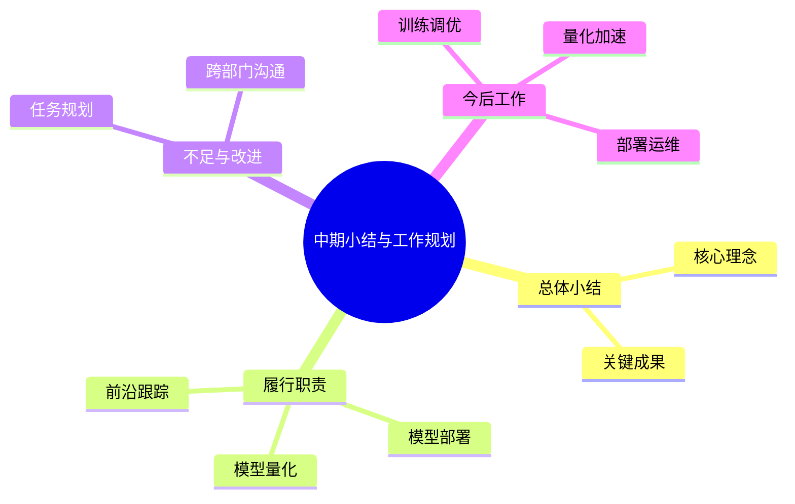
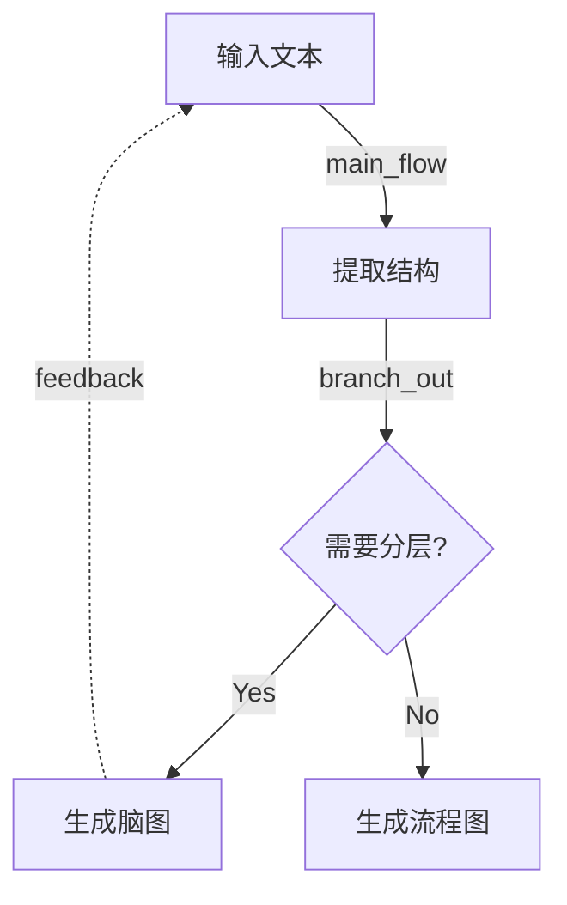
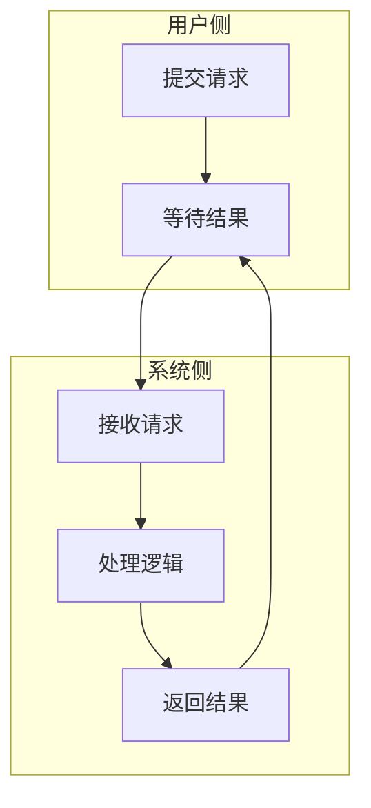
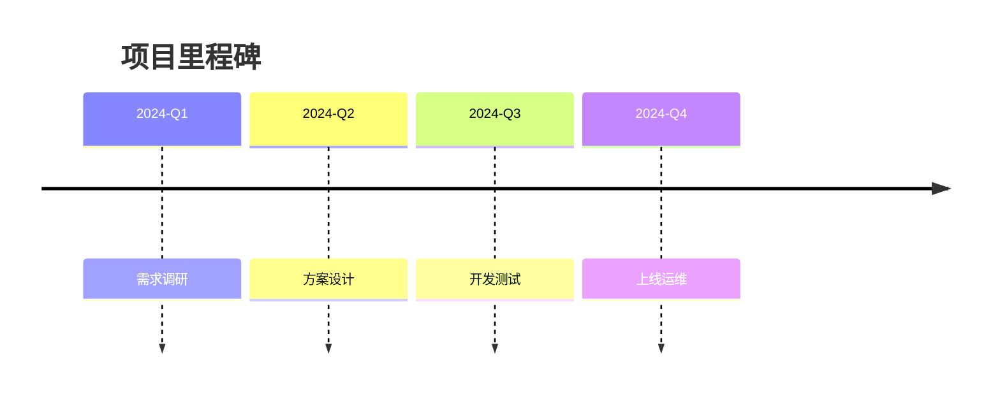

# Mindmap, Diagram & Visual Structure Skill

将非结构化或半结构化文本转为清晰的可视化形式，重点支持 **XMind 风格脑图**。

## 核心原则

**一张图只服务一个核心判断。**

生成图之前，先用一句话提炼这张图要传达的核心观点（core_judgment）。如果内容涉及多个核心判断，应拆成多张图。

## 适用场景

- 脑图 / 思维导图
- 架构图 / 技术架构图
- 流程图 / 业务流程图
- 泳道图 / 跨角色流程
- 时间线 / 里程碑图
- 漏斗图 / 转化流程
- 因果链 / 根因分析图
- 结构化提纲 / 汇报框架
- Mermaid 图表
- Draw.io 可导入结构

不适用：

- 不需要可视化的普通会议纪要
- 纯数据表格（无流程/层级关系）
- 学术领域有严格规范的特定图表

## 图类型选择

| 用户意图                         | 输出类型     | Mermaid 语法                |
| -------------------------------- | ------------ | --------------------------- |
| 梳理知识点、总结汇报、读书笔记   | Mind map     | `mindmap`                 |
| 展示步骤、条件分支、处理流程     | Flowchart    | `flowchart TD/LR`         |
| 展示系统组成、模块关系、调用链路 | Architecture | `graph LR`                |
| 展示交互时序、请求响应顺序       | Sequence     | `sequenceDiagram`         |
| 展示跨角色/跨部门协作流程        | Swimlane     | `flowchart TD` + subgraph |
| 展示项目里程碑、时间节点         | Timeline     | `timeline`                |
| 展示筛选/转化/漏斗过程           | Funnel       | `flowchart TD` 渐窄布局   |
| 展示问题根因、因果传导           | Causal chain | `flowchart LR`            |

## 分层工作流

生成图表时，遵循 **结构先行、布局其次、连线再次、样式最后** 的分层原则：

### Step 1: 提取结构与核心判断

从输入文本中提取：

- **core_judgment**: 一句话核心判断
- **nodes**: 关键节点列表（id + label + role）
- **edges**: 节点间关系（source → target + type）
- **main_path**: 主路径节点序列
- **branches / convergence / feedback**: 分支、汇聚、反馈点
- **not_suitable_for_diagram**: 不适合进图的内容（原始数据、情感描述、背景叙述等）

对于混乱输入，先分离：

- 事实 vs 观点
- 过程步骤 vs 情感评论
- 核心路径 vs 补充说明

只有过程、关系、机制和行动路径进入图层级。

### Step 2: 选择图类型并规范化层级

根据 Step 1 的结构，选择最合适的图类型（见上方选择表）。

规范化层级规则：

- 脑图：root → 一级分支（4-6个）→ 二级分支 → 三级分支
- 流程图：起止节点 → 处理节点 → 判断节点 → 汇聚节点
- 架构图：外部调用方 → 网关/入口 → 核心服务 → 存储/依赖

### Step 3: 生成图表代码

根据图类型生成 Mermaid 代码或结构化提纲。

连线语义标注：

| 连线类型    | 含义               | Mermaid 写法                |
| ----------- | ------------------ | --------------------------- |
| main_flow   | 主路径推进         | `A --> B`                 |
| branch_out  | 一处分支为多个输出 | `A --> B; A --> C`        |
| fan_in      | 多处汇聚为一个节点 | `B --> D; C --> D`        |
| feedback    | 反馈/回退          | `D -.-> A` 虚线           |
| convergence | 收敛/合并          | `B --> D; C --> D` + 注释 |

### Step 4: 输出与交付

根据用户需求选择输出形式：

- 纯 Mermaid 代码（默认）
- 结构化提纲 + Mermaid 代码
- XMind 可导入的 Markdown 大纲
- 完整可视化简报（含 flow_spec / layout_spec / connection_spec）

## XMind 风格脑图设计规则

当用户要求脑图时，默认以 XMind 风格输出：

- 一个明确的中心主题
- 4 到 6 个一级分支
- 简洁的分支标签
- 均匀嵌套的层级
- 每个分支包含简短、平行的子主题
- 细节节点紧凑，不用句子
- 内容按业务含义分组，而非按原文顺序

### 层级规则

1. **中心主题**: 简短概括，避免长标题，只含一个主题
2. **一级分支**: 代表主题的主要维度，保持相近抽象层次，4-6 个为宜
3. **二级分支**: 表达要点、模块或阶段，措辞平行，一个节点一个观点
4. **三级分支**: 解释细节、证据或示例，保持简短，不与高层概念混合
5. **视觉风格**: 紧凑、整洁的层级结构；XMind 导出场景推荐深色画布、彩虹分支色、粗体中心主题、圆角矩形

### 好的脑图特征

- 中心主题概括但不模糊
- 每个分支语义独立
- 标签简短且一致
- 信息按主题分组
- 细节支撑主干观点

### 应避免

- 段落式节点
- 同一分支混合不同抽象层次
- 一级分支过多（>7个）
- 不同分支含义重复
- 节点名称冗长

### 常用汇报结构分支

- 总体概述
- 主要成果
- 关键任务
- 问题与改进
- 后续规划

## Mermaid 输出规范

### Mind map

### Flowchart（含连线语义）

### Architecture

### Swimlane

### Timeline

## 文件管理规范

生成多张图时遵循以下规范：

- 所有图表相关文件统一放在 `.mddoc/` 目录（与当前文档平级）
- 文件名使用英文小写 + 连字符（如 `auth-flow`、`module-overview`），不用中文或序号
- 先写源文件 → 再生成图 → 再嵌入文档，顺序不可颠倒
- 源文件与渲染文件同时保留，方便后续修改
- `.mddoc/` 不存在时先创建

## 工具链参考

如需将 Mermaid 代码转为真实图片，推荐以下路径：

| 工具            | 用途                       | 说明                                                       |
| --------------- | -------------------------- | ---------------------------------------------------------- |
| mddoc-cli       | Markdown 中嵌入脑图/架构图 | `npm install -g mddoc-cli`                               |
| markmap-lib     | 脑图 SVG 渲染              | mddoc 内置                                                 |
| D2              | 高级架构图                 | `winget install terrastruct.d2`，比 Mermaid graph 更强大 |
| @resvg/resvg-js | SVG → PNG                 | mddoc 内置，零系统依赖                                     |

## 自检清单

输出图表前，逐项检查：

1. **核心判断**：能否用一句话说清这张图的核心观点？
2. **5 秒规则**：读者能否在 5 秒内看懂主路径/主要结构？
3. **节点数量**：主要节点是否超过 7 个？超过则应拆分为多张图
4. **连线含义**：每条边是否有明确语义（推进/分支/汇聚/反馈）？
5. **标签简短**：节点名称是否足够短（建议 ≤5 个词）？
6. **层级一致**：同级分支是否在同一抽象层次？
7. **信息排除**：是否有不适合进图的内容被正确排除？
8. **可独立实现**：另一个设计者能否不看原始对话就能实现这张图？
9. **XMind 风格**（仅脑图）：根节点简洁？一级分支平衡？细节下沉到低层级？

## 可选辅助文件

- `STYLE_GUIDE.md` — XMind 风格视觉目标与节点写作规范
- `REFERENCE.md` — 图表模式速查与最佳实践
- `templates/` — 各类型 Mermaid 模板
- `scripts/` — 转换与校验脚本
