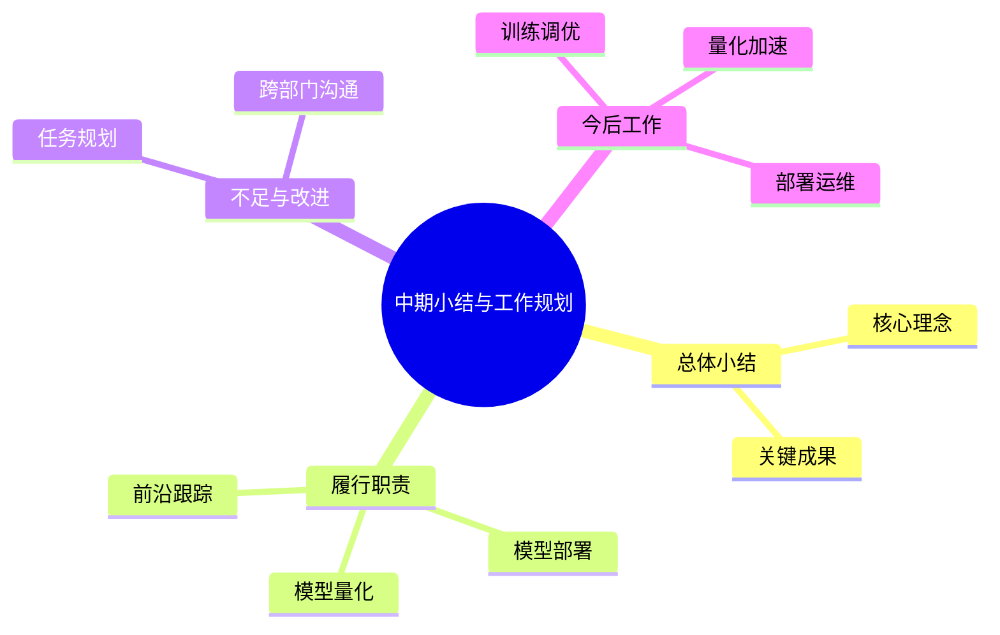
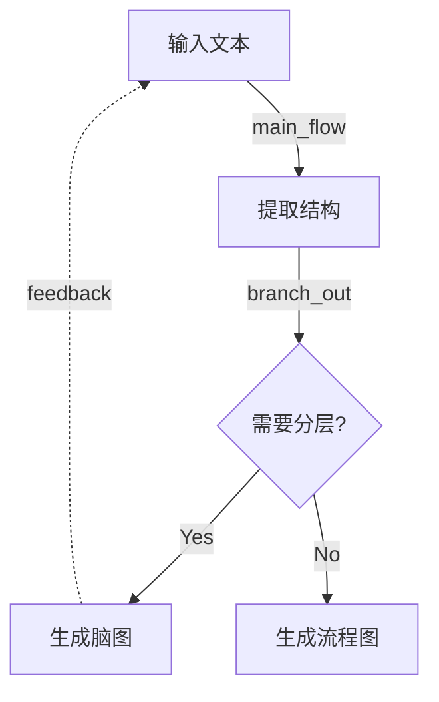
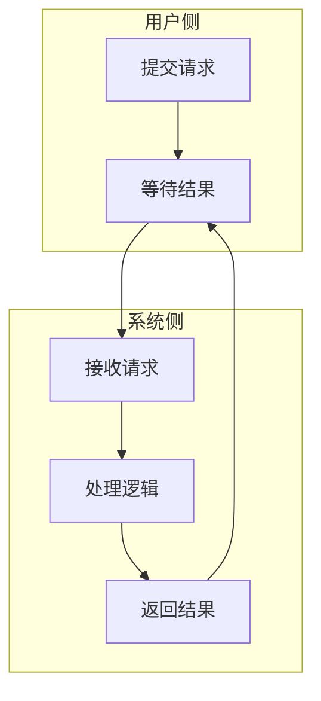
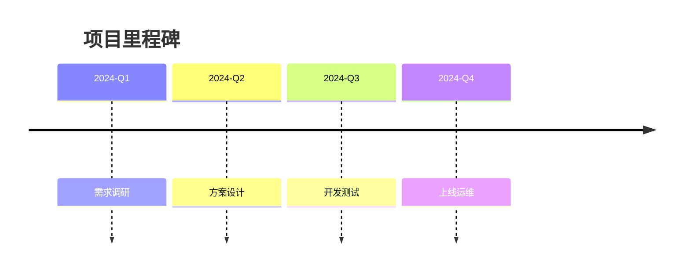

# Mindmap, Diagram & Visual Structure Skill

将非结构化或半结构化文本转为清晰的可视化形式，重点支持 **XMind 风格脑图**。

## 核心原则

**一张图只服务一个核心判断。**

生成图之前，先用一句话提炼这张图要传达的核心观点（core_judgment）。如果内容涉及多个核心判断，应拆成多张图。

## 适用场景

- 脑图 / 思维导图
- 架构图 / 技术架构图
- 流程图 / 业务流程图
- 泳道图 / 跨角色流程
- 时间线 / 里程碑图
- 漏斗图 / 转化流程
- 因果链 / 根因分析图
- 结构化提纲 / 汇报框架
- Mermaid 图表
- Draw.io 可导入结构

不适用：

- 不需要可视化的普通会议纪要
- 纯数据表格（无流程/层级关系）
- 学术领域有严格规范的特定图表

## 图类型选择

| 用户意图                         | 输出类型     | Mermaid 语法                |
| -------------------------------- | ------------ | --------------------------- |
| 梳理知识点、总结汇报、读书笔记   | Mind map     | `mindmap`                 |
| 展示步骤、条件分支、处理流程     | Flowchart    | `flowchart TD/LR`         |
| 展示系统组成、模块关系、调用链路 | Architecture | `graph LR`                |
| 展示交互时序、请求响应顺序       | Sequence     | `sequenceDiagram`         |
| 展示跨角色/跨部门协作流程        | Swimlane     | `flowchart TD` + subgraph |
| 展示项目里程碑、时间节点         | Timeline     | `timeline`                |
| 展示筛选/转化/漏斗过程           | Funnel       | `flowchart TD` 渐窄布局   |
| 展示问题根因、因果传导           | Causal chain | `flowchart LR`            |

## 分层工作流

生成图表时，遵循 **结构先行、布局其次、连线再次、样式最后** 的分层原则：

### Step 1: 提取结构与核心判断

从输入文本中提取：

- **core_judgment**: 一句话核心判断
- **nodes**: 关键节点列表（id + label + role）
- **edges**: 节点间关系（source → target + type）
- **main_path**: 主路径节点序列
- **branches / convergence / feedback**: 分支、汇聚、反馈点
- **not_suitable_for_diagram**: 不适合进图的内容（原始数据、情感描述、背景叙述等）

对于混乱输入，先分离：

- 事实 vs 观点
- 过程步骤 vs 情感评论
- 核心路径 vs 补充说明

只有过程、关系、机制和行动路径进入图层级。

### Step 2: 选择图类型并规范化层级

根据 Step 1 的结构，选择最合适的图类型（见上方选择表）。

规范化层级规则：

- 脑图：root → 一级分支（4-6个）→ 二级分支 → 三级分支
- 流程图：起止节点 → 处理节点 → 判断节点 → 汇聚节点
- 架构图：外部调用方 → 网关/入口 → 核心服务 → 存储/依赖

### Step 3: 生成图表代码

根据图类型生成 Mermaid 代码或结构化提纲。

连线语义标注：

| 连线类型    | 含义               | Mermaid 写法                |
| ----------- | ------------------ | --------------------------- |
| main_flow   | 主路径推进         | `A --> B`                 |
| branch_out  | 一处分支为多个输出 | `A --> B; A --> C`        |
| fan_in      | 多处汇聚为一个节点 | `B --> D; C --> D`        |
| feedback    | 反馈/回退          | `D -.-> A` 虚线           |
| convergence | 收敛/合并          | `B --> D; C --> D` + 注释 |

### Step 4: 渲染图片

将 Mermaid 源文件渲染为图片。**所有渲染方式均支持离线环境，无需联网。**

**推荐方式：通过 execute_skill_script 工具调用 render_diagram.py**

由于 sandbox 环境中工作目录是只读的，无法先创建 .mmd 文件再渲染。使用 `--stdin` 模式，将 Mermaid 内容通过 `input` 参数传入：

```
工具: execute_skill_script
参数:
  skill_name: mindmap-diagram-v3
  script_path: scripts/render_diagram.py
  args: ["--stdin", "--name", "<diagram-name>"]
  input: <Mermaid 代码内容>
```

脚本会自动：
1. 检测 mmdc 是否可用 → 可用则渲染 PNG/SVG
2. mmdc 不可用 → 生成内嵌 mermaid.js 的 HTML 文件（离线可用）
3. 输出 JSON 结果（含 base64 编码的图片或 HTML 内容）

**手动调用方式**（如有可写目录）：

```bash
# 从文件渲染
python scripts/render_diagram.py <name>.mmd

# 从 stdin 渲染
echo '<mermaid-code>' | python scripts/render_diagram.py --stdin --name diagram
```

3. **降级方案**：如果以上工具都不可用，仅输出 Mermaid 代码块，提示用户在 [Mermaid Live Editor](https://mermaid.live) 中粘贴查看（此步需联网）。

### Step 5: 输出与交付

**默认输出：可编辑源文件 + 渲染图片，缺一不可。**

每张图的交付物必须包含：

| 交付物       | 文件格式                                       | 用途                           |
| ------------ | ---------------------------------------------- | ------------------------------ |
| 可编辑源文件 | `.mmd`（Mermaid）或 `.md`（Markdown 大纲） | 后续修改、版本控制、二次编辑   |
| 渲染图片     | `.png` 或 `.svg`                           | 查看、分享、嵌入文档、汇报展示 |

输出规则：

1. 源文件和图片放在同一目录，文件名相同、扩展名不同
2. 先生成源文件 → 验证语法 → 渲染图片 → 检查图片
3. 在回复中先展示图片，再提供源文件内容或路径
4. 如果用户明确只要求代码/源文件，可以不渲染图片

额外可选输出（按用户需求）：

- XMind 可导入的 Markdown 大纲（脑图专用）
- Draw.io 可导入的结构（架构图专用）
- 完整可视化简报（含 flow_spec / layout_spec / connection_spec）

## XMind 风格脑图设计规则

当用户要求脑图时，默认以 XMind 风格输出：

- 一个明确的中心主题
- 4 到 6 个一级分支
- 简洁的分支标签
- 均匀嵌套的层级
- 每个分支包含简短、平行的子主题
- 细节节点紧凑，不用句子
- 内容按业务含义分组，而非按原文顺序

### 层级规则

1. **中心主题**: 简短概括，避免长标题，只含一个主题
2. **一级分支**: 代表主题的主要维度，保持相近抽象层次，4-6 个为宜
3. **二级分支**: 表达要点、模块或阶段，措辞平行，一个节点一个观点
4. **三级分支**: 解释细节、证据或示例，保持简短，不与高层概念混合
5. **视觉风格**: 紧凑、整洁的层级结构；XMind 导出场景推荐深色画布、彩虹分支色、粗体中心主题、圆角矩形

### 好的脑图特征

- 中心主题概括但不模糊
- 每个分支语义独立
- 标签简短且一致
- 信息按主题分组
- 细节支撑主干观点

### 应避免

- 段落式节点
- 同一分支混合不同抽象层次
- 一级分支过多（>7个）
- 不同分支含义重复
- 节点名称冗长

### 常用汇报结构分支

- 总体概述
- 主要成果
- 关键任务
- 问题与改进
- 后续规划

## Mermaid 输出规范

### Mind map



### Flowchart（含连线语义）



### Architecture


### Swimlane



### Timeline



## 文件管理规范

生成图表时遵循以下规范，确保每张图都有 **源文件 + 图片** 双份输出：

### 目录结构

```
工作目录/
├── .mddoc/                          # 所有图表文件统一目录
│   ├── auth-flow.mmd                # Mermaid 源文件（可编辑）
│   ├── auth-flow.png                # 渲染后的图片（查看/分享）
│   ├── module-overview.mmd          # 另一张图的源文件
│   └── module-overview.png          # 另一张图的渲染图片
```

### 命名规则

- 文件名使用英文小写 + 连字符（如 `auth-flow`、`module-overview`），不用中文或序号
- 同一张图的源文件与图片文件名相同，仅扩展名不同（`.mmd` vs `.png`）
- 脑图如果需要 XMind 兼容，额外生成一个 `.md` 大纲文件

### 操作顺序

1. 创建 `.mddoc/` 目录（如不存在）
2. 写 Mermaid 源文件 → `.mddoc/<name>.mmd`
3. 用 `validate_mermaid.py` 校验语法
4. 渲染图片 → `.mddoc/<name>.png`
5. 检查图片是否正常（文件大小 > 0）
6. 在回复中展示图片 + 提供源文件路径

**顺序不可颠倒，源文件必须先于图片存在。**

### 源文件保留

- 源文件与图片始终同时保留，不删除源文件
- 用户修改时，编辑源文件后重新渲染
- 批量重新渲染：`mmdc -i .mddoc/*.mmd` 或 `mddoc build`

## 渲染工具链

### 渲染方式优先级

| 优先级 | 工具                | 支持图类型        | 安装方式                                   |
| ------ | ------------------- | ----------------- | ------------------------------------------ |
| 1      | mmdc (Mermaid CLI)  | 全部              | sandbox 镜像已内置，无需额外安装           |
| 2      | render_diagram.py   | 全部（生成 HTML） | 本 skill 自带，无需安装                    |
| 3      | Mermaid Live Editor | 全部              | 在线降级方案                               |

### 各工具详细说明

**mmdc（推荐，sandbox 镜像已内置）**

Sandbox 镜像已预装 `@mermaid-js/mermaid-cli` 和 Chromium，可直接使用：

```bash
# 渲染 PNG
mmdc -p /etc/mermaid-cli/puppeteer-config.json -i .mddoc/auth-flow.mmd -o .mddoc/auth-flow.png -w 1600 -b white

# 渲染 SVG（矢量图，可无限放大）
mmdc -p /etc/mermaid-cli/puppeteer-config.json -i .mddoc/auth-flow.mmd -o .mddoc/auth-flow.svg -w 1600
```

> **注意**：必须添加 `-p /etc/mermaid-cli/puppeteer-config.json` 参数，指向 sandbox 镜像内置的 Puppeteer 配置文件。

**render_diagram.py（降级方案，本 skill 自带）**

当 mmdc 不可用时（如非 sandbox 环境），使用此脚本生成 HTML：

```bash
# 生成可渲染的 HTML 文件
python scripts/render_diagram.py .mddoc/auth-flow.mmd
# 输出: .mddoc/auth-flow.html（用浏览器打开查看）
```

### 渲染前检查

生成图片前，先检查工具是否可用：

```bash
# 检查 mmdc（sandbox 镜像已内置）
mmdc --version

# 如 mmdc 可用，直接渲染
mmdc -p /etc/mermaid-cli/puppeteer-config.json -i .mddoc/auth-flow.mmd -o .mddoc/auth-flow.png -w 1600 -b white
```

如果 mmdc 不可用，使用本 skill 自带的 `render_diagram.py` 生成 HTML。

## 自检清单

输出图表前，逐项检查：

**结构质量**

1. **核心判断**：能否用一句话说清这张图的核心观点？
2. **5 秒规则**：读者能否在 5 秒内看懂主路径/主要结构？
3. **节点数量**：主要节点是否超过 7 个？超过则应拆分为多张图
4. **连线含义**：每条边是否有明确语义（推进/分支/汇聚/反馈）？
5. **标签简短**：节点名称是否足够短（建议 ≤5 个词）？
6. **层级一致**：同级分支是否在同一抽象层次？
7. **信息排除**：是否有不适合进图的内容被正确排除？

**交付完整性**
8. **双份输出**：是否同时生成了源文件（.mmd）和图片（.png/.svg）？
9. **源文件可编辑**：源文件语法是否正确？修改后能否重新渲染？
10. **图片可查看**：图片文件是否生成成功且内容完整？
11. **XMind 风格**（仅脑图）：根节点简洁？一级分支平衡？细节下沉到低层级？

## 可选辅助文件

- `STYLE_GUIDE.md` — XMind 风格视觉目标与节点写作规范
- `REFERENCE.md` — 图表模式速查与最佳实践
- `templates/` — 各类型 Mermaid 模板
- `scripts/` — 转换、校验、渲染脚本
  - `outline_to_mermaid.py` — Markdown 大纲转 Mermaid
  - `validate_mermaid.py` — 校验 Mermaid 语法与节点数量
  - `split_complex_graph.py` — 复杂图拆分为多张子图
  - `render_diagram.py` — Mermaid 源文件渲染为 HTML（降级方案）
