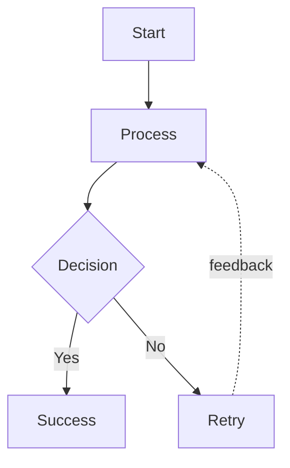
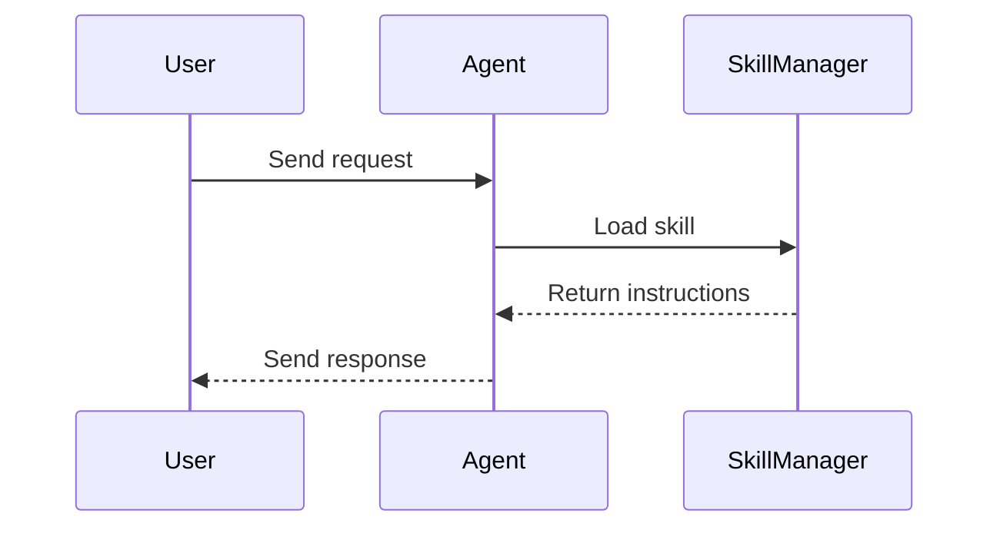

# Diagram Reference Guide

## 支持的图表类型

| 类型 | 最佳用途 | 优先语法 / 引擎 |
|---|---|---|
| mindmap | 知识结构、总结汇报、读书笔记 | Markdown 大纲 → 自动选引擎（Mermaid / Graphviz） |
| flowchart | 流程、决策、逻辑分支 | 自动选引擎：D2 → Graphviz → Mermaid |
| graph / architecture | 模块关系、调用链路 | 自动选引擎：D2 → Graphviz → Mermaid |
| sequenceDiagram | 交互时序、请求响应 | Mermaid |
| swimlane | 跨角色/跨部门流程 | D2 → Graphviz → Mermaid |
| timeline | 项目里程碑、时间节点 | Mermaid |
| funnel | 筛选/转化流程 | Graphviz / Mermaid |
| causal chain | 根因分析、因果传导 | Graphviz / D2 |

## Mind map 模式

### 推荐源文件
使用 Markdown 标题层级：

```md
# 项目复盘与后续计划
## 总体概述
### 目标
### 结论
## 关键成果
### 模型效果
### 业务价值
```

### 推荐输出
- `project-outline.md`
- `project-outline.svg`

## Flowchart 模式



## Architecture 模式

```d2
User -> Gateway -> ServiceA
Gateway -> ServiceB
ServiceA -> Database
ServiceB -> Cache
```

## Sequence 模式



## 典型文件结构

```text
.mddoc/
├── project-outline.md
├── project-outline.svg
├── auth-flow.d2
├── auth-flow.svg
├── service-map.dot
├── service-map.png
└── timeline.mmd
```

## 输出规则

1. 源文件和渲染产物文件名保持一致，仅扩展名不同
2. 优先输出 SVG，必要时再输出 PNG
3. 复杂图优先用本地渲染器
4. 运行阶段不依赖在线资源；构建镜像阶段可以联网安装依赖

## 渲染优先级

| 输入 | 优先渲染器 | 说明 |
|---|---|---|
| `.md` | 自动选引擎（Mermaid mindmap / Graphviz `twopi`） | 脑图 / 大纲树 |
| `.dot` | Graphviz `dot/twopi/neato` | 依图类型自动选择 |
| `.d2` | `d2` | 自动布局效果更强 |
| `.mmd` | `mmdc` | Mermaid 兼容输出 |

## 使用建议

- 脑图：层级要稳，节点要短
- 流程图：减少交叉，主路径明确
- 架构图：模块分区清楚
- 时序图：参与方名称短且统一


## 自动选引擎规则

- 大纲型输入且节点较少：优先 Mermaid mindmap，便于快速预览。
- 大纲型输入但层级较深、分支较多：优先 Graphviz `twopi`。
- 流程/架构文本中包含明显的条件、分支、模块依赖、属性声明：优先 D2。
- 明确 DOT 语法或 Graphviz 风格：直接走 Graphviz。
- 时序/时间线：保留 Mermaid。
