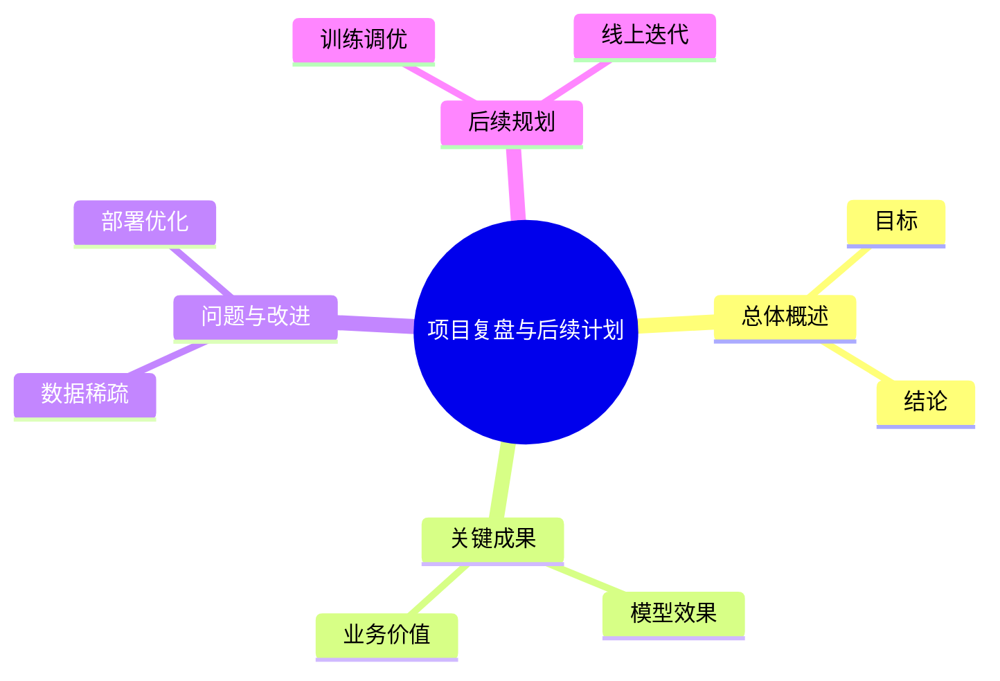
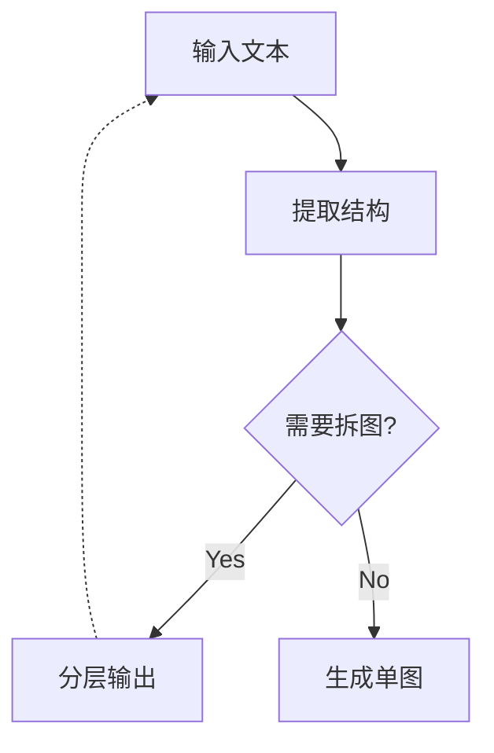

# Mindmap, Diagram & Visual Structure Skill

将非结构化或半结构化文本转为清晰、适合汇报的可视化结构。

## 总目标

**离线优先，布局优先，输出稳定优先。**

- 运行时不依赖 CDN，不要求联网。
- 镜像构建阶段可以联网，用于一次性安装字体、Graphviz、D2、Mermaid CLI 等依赖；构建完成后，运行阶段必须保持离线可用。
- 优先使用本地可执行工具完成渲染。
- 脑图优先采用 Graphviz 的 radial 布局，复杂流程图优先考虑 D2 或 Graphviz。
- 保留 Mermaid 作为兼容与降级方案。

## 核心原则

**一张图只服务一个核心判断。**

先用一句话提炼这张图要表达的核心观点（core_judgment）。如果内容包含多个核心判断，应拆成多张图。

## 适用场景

- 脑图 / 思维导图
- 架构图 / 技术架构图
- 流程图 / 业务流程图
- 泳道图 / 跨角色流程
- 时间线 / 里程碑图
- 漏斗图 / 转化流程
- 因果链 / 根因分析图
- 结构化提纲 / 汇报框架

不适用：

- 不需要可视化的普通会议纪要
- 纯数据表格
- 学术领域有严格规范的专门图表

## 图类型选择

### 自动选引擎策略

在 `kind=auto` 或未明确指定渲染器时，系统会先识别文本语义，再选择最合适的后端：

| 语义特征                      | 首选后端           | 说明                                                                |
| ----------------------------- | ------------------ | ------------------------------------------------------------------- |
| Markdown 标题 / 列表大纲      | Graphviz / Mermaid | 节点少时可用 Mermaid mindmap，节点多或分支多时切 Graphviz `twopi` |
| 条件判断、步骤推进、分支汇聚  | D2                 | 布局紧凑，适合流程图与架构图                                        |
| 明确 DOT 语法或 Graphviz 特征 | Graphviz           | 适合复杂依赖关系、显式布局控制                                      |
| 时序、时间线                  | Mermaid            | 语法最直接，兼容性高                                                |

自动路由的核心原则是：**优先使用最少编辑成本、最清晰布局的本地引擎**。

| 用户意图                         | 优先输出     | 说明                                                  |
| -------------------------------- | ------------ | ----------------------------------------------------- |
| 梳理知识点、总结汇报、读书笔记   | Mind map     | 默认源文件为 Markdown 大纲，渲染为 Graphviz radial 图 |
| 展示步骤、条件分支、处理流程     | Flowchart    | 复杂流程优先 D2，其次 Graphviz，最后 Mermaid          |
| 展示系统组成、模块关系、调用链路 | Architecture | 优先 D2 / Graphviz，自动布局更清爽                    |
| 展示交互时序、请求响应顺序       | Sequence     | Mermaid 最稳                                          |
| 展示跨角色/跨部门协作流程        | Swimlane     | 先 D2 / Graphviz，需分区清晰                          |
| 展示项目里程碑、时间节点         | Timeline     | Mermaid 优先，简单直接                                |
| 展示筛选/转化/漏斗过程           | Funnel       | Flowchart 或 Graphviz                                 |
| 展示问题根因、因果传导           | Causal chain | Graphviz / D2 优先，避免连线交叉                      |

## 分层工作流

### Step 1: 提取结构与核心判断

从输入文本中提取：

- **core_judgment**: 一句话核心判断
- **nodes**: 关键节点列表（id + label + role）
- **edges**: 节点间关系（source → target + type）
- **main_path**: 主路径节点序列
- **branches / convergence / feedback**: 分支、汇聚、反馈点
- **not_suitable_for_diagram**: 不适合进图的内容（原始数据、情绪性描述、背景冗述等）

先分离：

- 事实 vs 观点
- 过程步骤 vs 情绪评论
- 核心路径 vs 补充说明

只有过程、关系、机制和行动路径进入图层级。

### Step 2: 选择图类型并规范化层级

- 脑图：root → 一级分支（4–6 个）→ 二级分支 → 三级分支
- 流程图：起止节点 → 处理节点 → 判断节点 → 汇聚节点
- 架构图：外部调用方 → 网关/入口 → 核心服务 → 存储/依赖

### Step 3: 生成图表代码

按图类型输出最适合的文本图语言：

- 脑图：Markdown 标题层级（`.md`）
- 流程图 / 架构图 / 因果链 / 泳道图：优先 D2，其次 Graphviz DOT，再次 Mermaid
- 时序图：Mermaid
- 需要强交互时，输出 HTML 作为补充预览

连线语义标注：

| 连线类型    | 含义               | 推荐写法                    |
| ----------- | ------------------ | --------------------------- |
| main_flow   | 主路径推进         | `A --> B`                 |
| branch_out  | 一处分支为多个输出 | `A --> B; A --> C`        |
| fan_in      | 多处汇聚为一个节点 | `B --> D; C --> D`        |
| feedback    | 反馈/回退          | `D -.-> A`                |
| convergence | 收敛/合并          | `B --> D; C --> D` + 注释 |

### Step 4: 离线渲染

> 说明：这里的“离线”指**使用阶段离线**。镜像构建时可以联网安装依赖，但打包后的运行环境必须不再依赖外网。

渲染优先级如下：

1. **本地原生渲染器**
   - `.md` 脑图 → 自动选引擎（小图可 Mermaid mindmap，大图优先 Graphviz `twopi`）
   - `.dot` → Graphviz `dot/twopi/neato`
   - `.d2` → `d2`
   - `.mmd` → `mmdc`
2. **离线 HTML 预览**
   - 无法生成图片时，输出自包含 HTML
3. **最后降级**
   - 仅输出源代码，并明确说明缺少本地渲染器

**禁止依赖在线 CDN。**

推荐调用方式：

```bash
python scripts/render_diagram.py <input-file>
python scripts/render_diagram.py --stdin --name diagram --kind mindmap
```

脑图场景下，`--stdin` 的输入应为 Markdown 大纲。

### Step 5: 输出与交付

默认输出：**可编辑源文件 + 渲染产物**，缺一不可。

| 交付物       | 文件格式                                | 用途                           |
| ------------ | --------------------------------------- | ------------------------------ |
| 可编辑源文件 | `.md` / `.mmd` / `.d2` / `.dot` | 后续修改、版本控制、二次编辑   |
| 渲染产物     | `.svg` / `.png` / `.html`         | 查看、分享、嵌入文档、汇报展示 |

输出规则：

1. 源文件和渲染产物放在同一目录，文件名相同、扩展名不同
2. 先生成源文件 → 再渲染 → 最后检查产物
3. 回复里先给最终图，再给源文件路径或内容
4. 如果用户明确只要源文件，可以不渲染

## 脑图专用规则

脑图默认采用 **Markdown 大纲 → Graphviz radial 图**：

- 使用 `#` / `##` / `###` 组织层级
- 中心主题尽量短
- 一级分支控制在 4–6 个
- 子节点保持平行、短词化
- 节点越多，越要压缩文字长度

### 脑图输出示例

```markdown
# 项目复盘与后续计划
## 总体概述
### 目标
### 结论
## 关键成果
### 模型效果
### 业务价值
## 问题与改进
### 数据稀疏
### 部署优化
## 后续规划
### 训练调优
### 线上迭代
```

## Mermaid 兼容输出

在以下情形仍可输出 Mermaid：

- 用户明确要求 Mermaid
- 系统只支持 Mermaid
- 时序图、简单时间线、简单流程图

### Mermaid Mind map 示例



### Flowchart 示例



## 文件组织建议

```
.mddoc/
├── project-outline.md     # 脑图源文件（Markdown 大纲）
├── project-outline.svg    # Graphviz 渲染结果
├── auth-flow.d2           # 复杂流程图（D2）
├── auth-flow.svg
├── service-map.dot        # Graphviz 图
├── service-map.png
├── timeline.mmd           # Mermaid 兼容图
└── timeline.html
```

## 部署约定

- **镜像构建阶段**：允许联网，用于安装 Graphviz、D2、Mermaid CLI、中文字体等依赖。
- **运行阶段**：必须离线可用，所有渲染器与字体都应已预装到镜像中。
- 不要在运行时通过脚本在线下载依赖或字体。

示例 Dockerfile 思路（构建时可联网，运行时离线）：

```dockerfile
FROM ubuntu:22.04
RUN apt-get update \
 && apt-get install -y graphviz fonts-noto-cjk nodejs npm curl \
 && npm install -g @mermaid-js/mermaid-cli \
 && curl -fsSL https://d2lang.com/install.sh | sh \
 && rm -rf /var/lib/apt/lists/*

COPY . /app
WORKDIR /app
```

## 自检清单

- [ ] 图只表达一个核心判断
- [ ] 脑图层级不超过 3–4 层
- [ ] 一级分支数量不过多
- [ ] 节点文本简短、平行
- [ ] 复杂图优先使用 D2 / Graphviz
- [ ] 运行阶段不依赖联网资源
- [ ] 渲染产物清晰可缩放

## Offline Validation Extensions

新增 `scripts/validate_dot_d2.py`：

- Graphviz DOT：

  - 调用 `dot -Tsvg` 进行 dry-run 解析
  - 可在真正渲染前提前发现语法错误
- D2：

  - 调用 `d2 --check`
  - 支持离线 CI / Docker 校验

推荐流程：

```bash
python scripts/validate_dot_d2.py demo.dot
python scripts/validate_dot_d2.py architecture.d2
```

推荐部署依赖：

```bash
apt install graphviz fonts-noto-cjk
# 构建镜像阶段可联网安装 D2；运行阶段不再依赖网络
curl -fsSL https://d2lang.com/install.sh | sh
npm install -g @mermaid-js/mermaid-cli
```

如果你的环境要求“构建时可联网、运行时完全离线”，建议在 Dockerfile 中把这些依赖预装进镜像，而不是在运行时动态下载。
